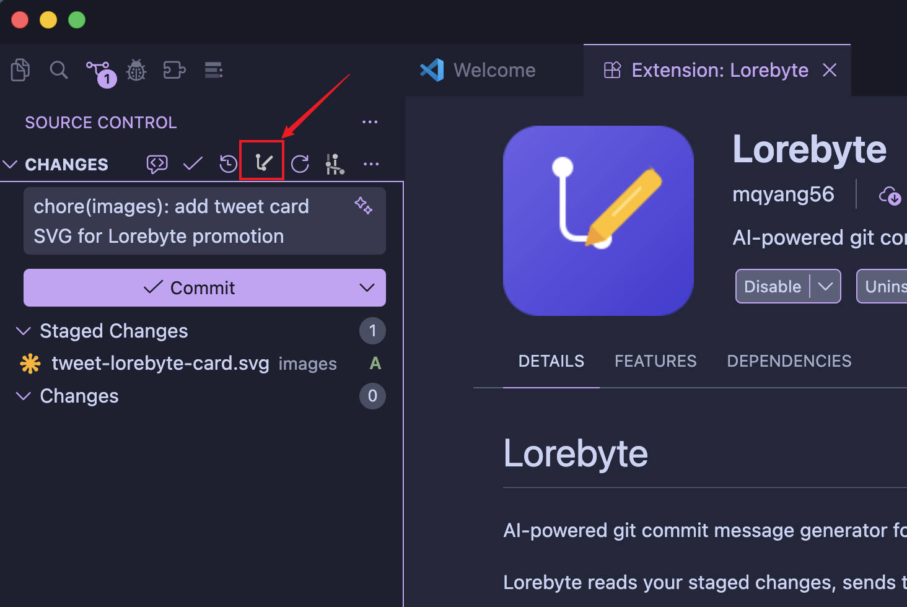

# Lorebyte

[English](README.md) | [中文](README_zh.md)

AI-powered git commit message generator for VS Code.

Lorebyte reads your staged changes, sends the diff to an LLM, and writes a [Conventional Commits](https://www.conventionalcommits.org/) message directly into the Source Control input box — one click, done.

## Features

- **One-click commit messages** — click the Lorebyte icon in the Source Control title bar or run the command from the palette
- **Smart generation** — if the commit input box is empty, generates a message from scratch; if it already contains text, refines and optimizes the existing message based on the staged diff
- **Conventional Commits** — generates messages following the `<type>(<scope>): <description>` format
- **Chinese / English** — commit messages can be generated in Chinese or English
- **Model selection** — browse and switch between available models via API
- **Configurable provider** — ships with [OpenCode Zen](https://opencode.ai/docs/zen/) support, extensible via a provider registry

## Quick Start

1. Install the extension
2. Stage some changes in git
3. Click the Lorebyte icon in the Source Control title bar (or run `Lorebyte: Generate Commit Message` from the Command Palette)

The generated message appears in the commit input box, ready to commit.

> **No API key needed to get started.** Lorebyte ships with a built-in free key so you can use it immediately. To unlock all available models, set your own API key in Settings: **Lorebyte > Api Key**.



## Commands

| Command | Description |
|---------|-------------|
| `Lorebyte: Generate Commit Message` | Generate a commit message from staged changes |
| `Lorebyte: List Available Models` | Browse remote models and switch the active model (requires a personal API key) |

## Settings

| Setting | Default | Description |
|---------|---------|-------------|
| `lorebyte.provider` | `opencode-zen` | LLM provider ID |
| `lorebyte.model` | `minimax-m2.5-free` | Model ID for generating commit messages |
| `lorebyte.apiKey` | — | Your personal API key. Leave empty to use the built-in free key (default model only). |
| `lorebyte.apiBaseUrl` | `https://opencode.ai/zen/v1/chat/completions` | API endpoint URL |
| `lorebyte.language` | `English` | Language for generated commit messages (`English` / `Chinese`) |

## Development

### Prerequisites

- Node.js >= 18
- VS Code >= 1.85.0

### Build

```bash
npm install
npm run compile
```

### Watch mode

```bash
npm run watch
```

### Lint

```bash
npm run lint
```

Press **F5** in VS Code to launch an Extension Development Host with the extension loaded.

## License

MIT
